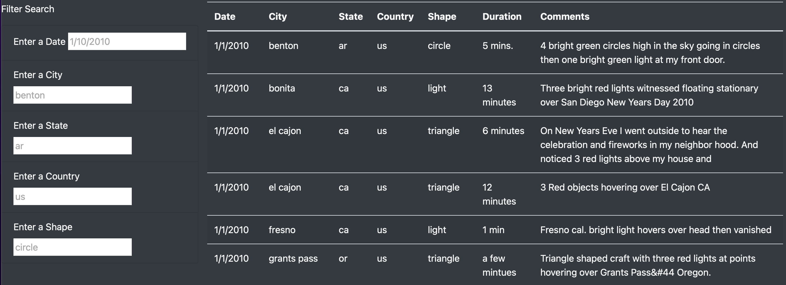
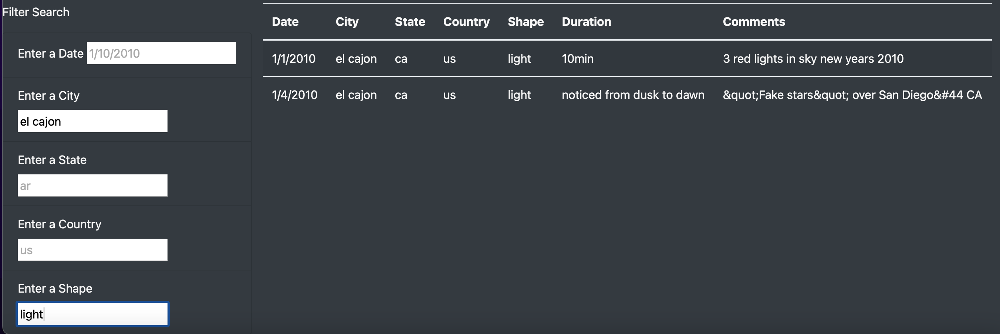

# UFOs

## Purpose
The purpose of this analysis is to assist client with providing more in-depth analysis of UFO sightings by allowing users to filter for multiple criteria
at the same time. 

## Results

Once in the webpage, the user should navigate to the bottom left and find “Filter Search”. There are 5 input boxes to filter data by including "Date", “City”, 
“State”, “Country” and “Shape”.

 

Without entering any information, the user will see all data populated in the table. To filter, the user should input criteria in at least one of the
fields. The user can provide input in multiple fields at once. Once the input is entered, the user should hit “enter” and the table will filter. 

## Summary

The new design works well in returning information based on filters. The following are recommendations for further development to enhance user experience
and address potential drawbacks. 

•	Case Sensitive: The filters are case sensitive. If the user enters “benton” in the city field, the table will appropriately filter and return one
instance for “benton”. However, if user were to type the city name with a capital letter, i.e. “Benton”, the table will not return any values. To address
this drawback, the code can be updated to ensure it is not case sensitive. 

•	Drop Down Menu: In using the filters, the user may not be aware of all options available under each field. For example, the user may not be aware that
under the shape field, options available include “circle”, “triangle”, “formation”, etc. To address this drawback, the code can be updated to provide a
drop down menu such the user can select from. 

